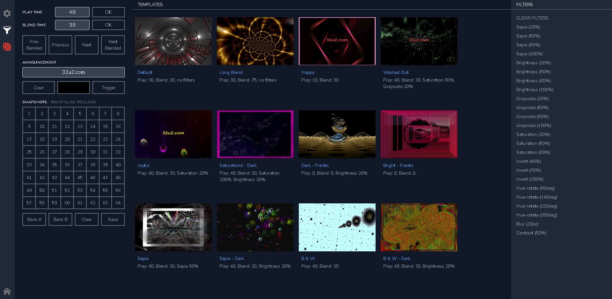

# About

Quick starter with Go, Vue, Heroku and PubSub. Inspired by "decentralized display fleet" use case brief.

## Background

[32u2](http://32u2.com) prototype app has a punchline "pocket-dial your visuals". It is a VJ application with mobile remote control.
The music visualizer desktop app (Go+Astilectron) communicates with the paired mobile remote over Websockets and a Wi-Fi network.

For a truly remote VJ experience the new web interface will control desktop app from anywhere in the world (or from the VJ booth)
using PubSub for the app control and gRPC for speedy asset delivery. Here is one early screenshot (realized with Tailwind css):



## Stack

- Golang
- Vue
- Pubsub
- gRPC
- Heroku

## Deployment

Three ways to deploy:

1) Heroku git
2) GitHub - manual deployment
3) GitHub - automated deployment

## Test (PubSub, gRPC)

```
cd app
npm run build
cd ..
go run main.go
```

Test url: 127.0.0.1:5000/chat-test

## Command line refresher

Dependencies:
```
go mod vendor
go mod tidy
```

Heroku deployment:
```
git add .
git commit -am "my commit"
git push heroku main
```

Other Heroku:
```
heroku create <app-name>
heroku local
heroku logs --tail
heroku open
heroku apps:destroy my-app-name
go build -o bin/my-app-name -v .
$ git push heroku main
$ heroku open
```

## Reading

For more information about using Go on Heroku, see these Dev Center articles:

- [Go on Heroku](https://devcenter.heroku.com/categories/go)
- [Heroku GitHub Integration](https://devcenter.heroku.com/articles/github-integration)

## Further work

Vue app source is contained in the ```app``` folder and, as per ```vue.config.js```, the output is compiled into ```static``` folder.
In production, the app's ```index.html``` is then loaded as a Golang template.

It would also be trivial to pack the content of the ```static``` folder into the executable using [go.rice](https://github.com/GeertJohan/go.rice)
and thus ending with a single file for deployment.

